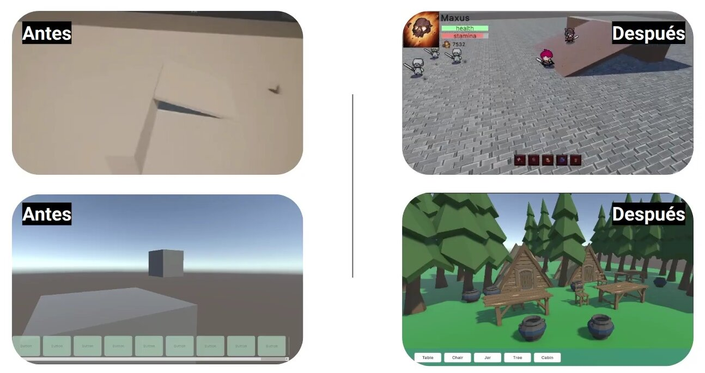
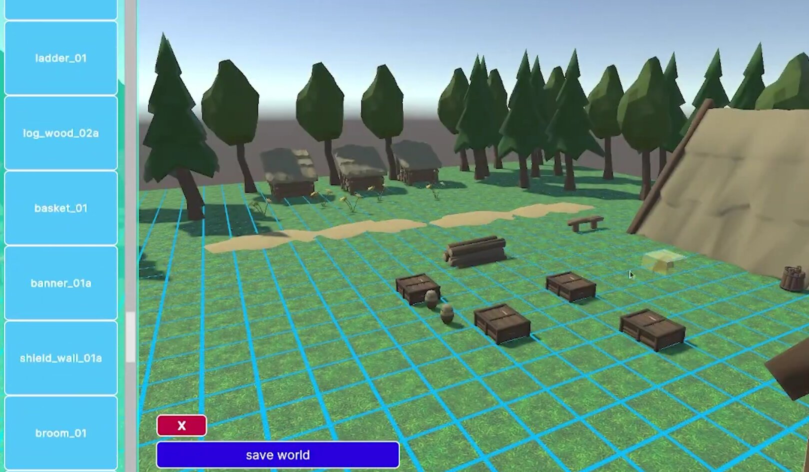

# First Look

Hello everyone!

Today we'd like to share a closer look at the progress we've made on **Feed the Realm** and the vision that continues to drive the project forward.

For those unfamiliar with the concept, Feed the Realm is built around a simple idea: making MMO world creation accessible to everyone.

Traditional MMO RPG development requires significant technical expertise, large teams, and substantial resources. Our goal is to remove those barriers by providing an ecosystem where players can not only explore and play online worlds, but also create, publish, and eventually monetize their own experiences.

To achieve this, the project is divided into two core components:

* A **World Creator**, where users can design their own MMO worlds, stories, NPCs, enemies, environments, and adventures.
* A **Game Client**, where players can discover and join these worlds to explore and play together.

Over the past development cycle, we've made significant progress on both fronts.

### Core Systems Taking Shape

What began as a collection of early prototypes has evolved into a much more robust foundation.

Several key systems are now functional, including:

* Multiplayer networking infrastructure
* Player movement and combat
* Enemy spawning and loot drops
* Inventory management
* Account registration and authentication
* Character creation and customization
* World editing tools

Players can already create accounts, customize their characters, browse available worlds, and join multiplayer sessions hosted by other users.

Inside the game, they can explore environments, fight enemies, collect loot, and manage their inventories. While many RPG systems are still under development, the core gameplay loop is now operational.

### Introducing the World Creator

One of the most exciting milestones has been the continued development of the World Creator.

Creators can already:

* Place and remove objects within a world grid
* Save worlds locally
* Continue editing projects over multiple sessions

The ability to publish worlds directly to the platform is currently under active development and is planned for an upcoming release.

This feature represents a major step toward our long-term vision of a fully player-driven MMO ecosystem.

### Building the Foundation

Beyond gameplay features, we've invested considerable effort into the project's architecture and development workflow.

Our current technology stack includes:

* Unity and C# for the game client, dedicated server, and world creator
* Go for backend services
* PostgreSQL for persistent data storage

The backend currently handles authentication, user management, and world-related services, while future development will focus on scalable cloud deployment and distributed server infrastructure.

We've also established project planning processes, user story mapping, version tracking, and sprint-based development workflows to help guide future growth.

### Challenges Along the Way

Like any ambitious project, development has not been without challenges.

One of the biggest hurdles has been balancing project development alongside academic responsibilities, which required us to adjust scope and prioritize foundational systems.

Additionally, the team invested significant time learning new technologies and workflows, particularly within Unity. Through internal workshops, experimentation, and proof-of-concept projects, we've steadily increased both our technical knowledge and development velocity.

These lessons have already begun paying off as new features become easier to design and implement.

### Looking Ahead

Our next development milestones focus on expanding both gameplay and creation capabilities.

Planned features include:

* Quests and NPC systems
* Player economies and marketplaces
* Persistent progression systems
* Custom asset support for creators
* Cloud-hosted game worlds
* Automatic server scaling
* Improved world editing tools
* Monitoring and infrastructure management

As these systems come online, Feed the Realm will move closer to its goal of becoming a platform where anyone can create, share, and experience unique MMO worlds.

We're excited about what comes next and look forward to sharing more progress in future developer updates.

Thank you for following the journey!

