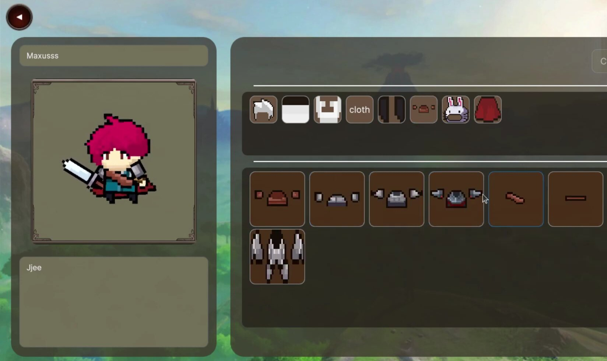
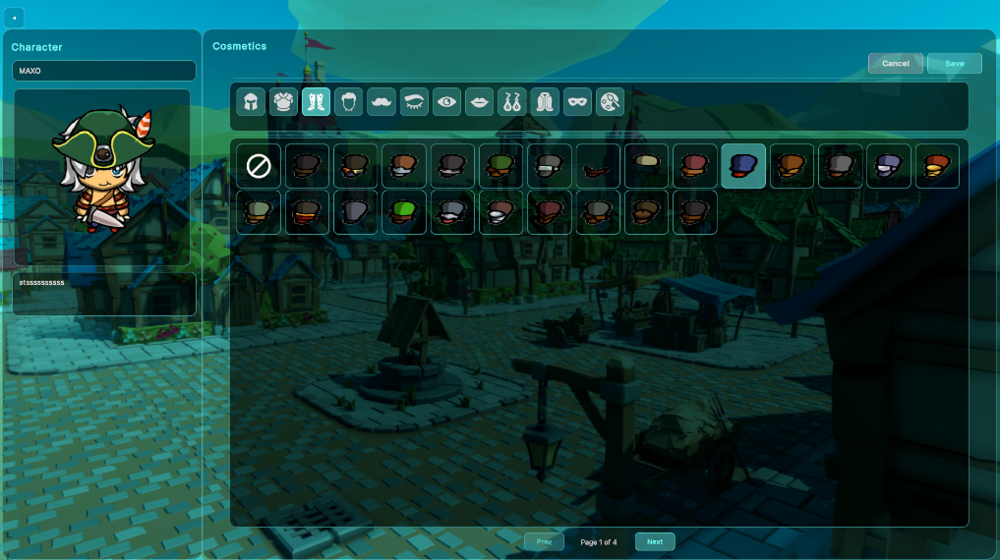

# Characters Update

Hey everyone!

Characters are very important to us, and the customization we want to maintain is a lot of work, for that we need to have the best
base assets that we can and that have the least amount of constraints possible.

We wanted for players to be able to make themselves, make other people or even make characters from other universe, that is why we needed highly
customizable detachable body parts and accessories.
In order to do that we thought the best idea was to switch from the more limiting assets that we had from the beginning to a new pack with many
more base cosmetics and interchangeable character bodies.

This change not only gives the game a different look but also allows for creators to adapt faster to the cosmetics and items specifications and focus on art quality.

Here is a screenshot of the old sprites in the characters editor taken from a previous blog post:

And now here is a sneak peek at what the new ones look like:

Stay tuned for more updates!
