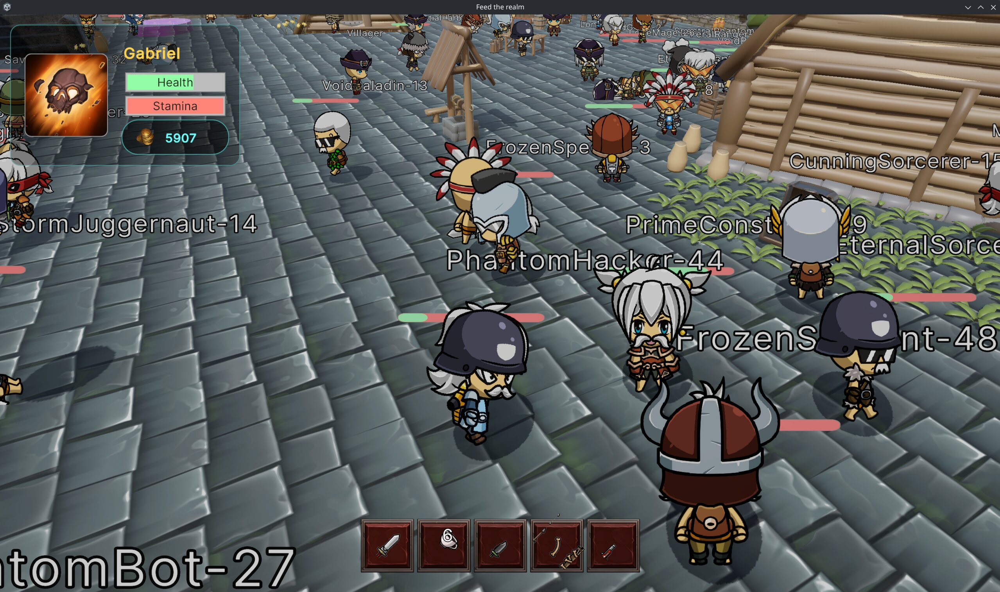

# First Alpha Test

Hello everyone!

We're excited to share that development has reached a major milestone. 
We've completed all of the core gameplay systems to a level where the game is now fully testable (but with many bugs and features to come).

Because of this, we invited a small group of private alpha testers to jump in, have fun, and most importantly, push the game to its limits.
Their goal was to uncover bugs, identify usability issues, and highlight features that felt unintuitive, unnecessary, or simply not enjoyable.

The results were incredibly valuable.

From this testing phase, we've built a substantial backlog of fixes, polish tasks, feature improvements, and design adjustments. 
Some features will be expanded, others will be simplified, and a few may be removed entirely based on player feedback.

One particularly interesting discovery was how differently players engaged with the project. Some testers were drawn more toward the world-building and creation tools,
while others preferred focusing on the gameplay experience itself. This insight will help guide future development and prioritization.

Alongside gameplay testing, we also conducted a large-scale server load test. While real players were actively playing,
we gradually introduced bot-controlled players to simulate increasing server demand. We tested scenarios with 20, 50, 75, and up to 100 concurrent players within the same zone.

These tests provided valuable performance metrics and helped us identify several bottlenecks that will be addressed in upcoming updates.

All of the improvements and changes resulting from this testing phase are planned for the next release: **v0.7.0**.

Stay tuned for more updates!

### Screenshot captured by a player during the load test

