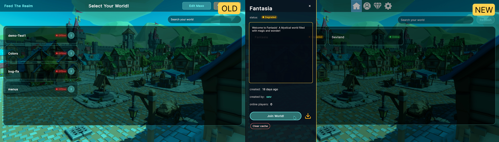
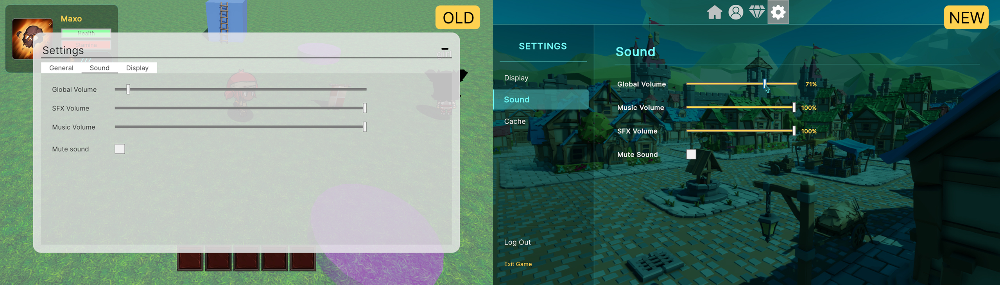
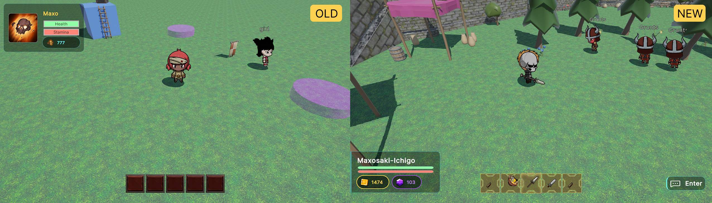

# Game UI Overhaul

Hello everyone!

We wanted to let you all know that we have been working hard on enhancing the UI of the entire game in response to some comments/critics that alpha testers gave us and for which we are thankful. We called this process the UI overhaul.

In this post we will focus on the gameplay side of Feed the Realm, so the world editor will be covered in another post.

We started by selecting the best UI pieces that we considered were worth keeping, such as the style of the character creator and gem store page, and from there we extrapolated that style to all the rest of UI elements.
Additionally we had some components made by an artist such as the inventory and fast access slots which fit perfectly with the new look we wanted to achieve.

The work we put in resulted in the following before/after comparisons:

These are just some examples of the changes we made, in follow up posts you will be able to take a look at more additions or enhancements!

Stay tuned for more updates!

