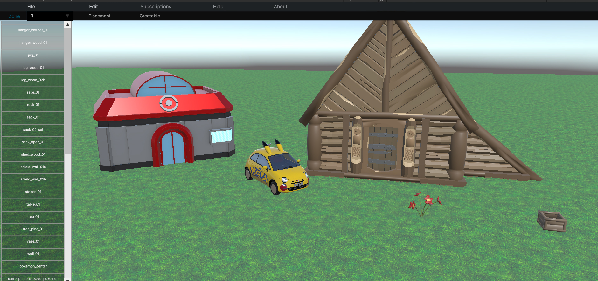
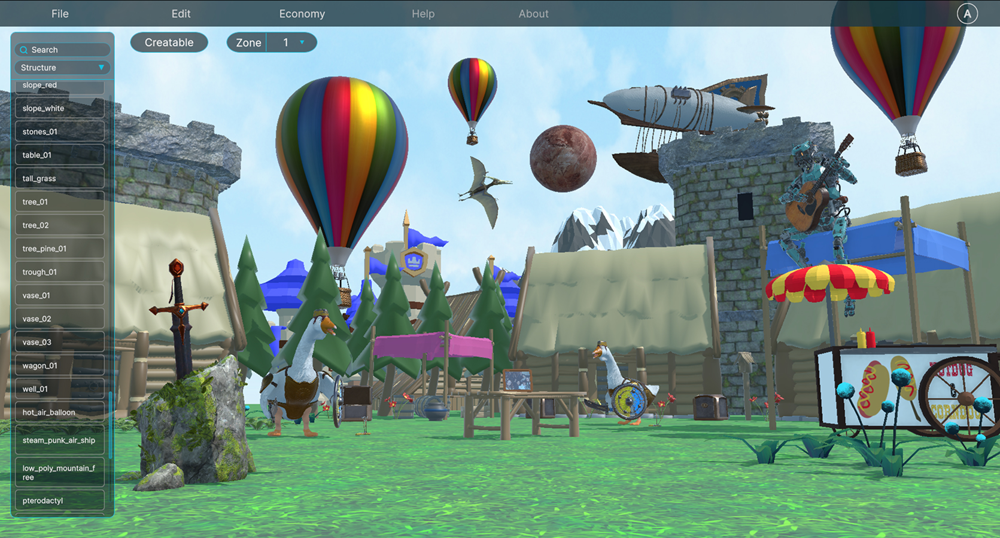

# World Editor is now in ALPHA

Hello everyone!

We're excited to share that the World Editor is now in ALPHA! This means that players can now access the World Editor and create their own custom worlds. We can't wait to see what amazing creations our community will come up with!

Recently we did a UI Overhaul due to user feedback and due to some responsiveness issues. Something really cool that we 
kept noticing throught the development of it was the fact that, it's actually looking like an actual game!

Also, we added some quality of life improvements such as the ability to move spawners, some more shortcuts and better UI panels for each creatable that allows a more comprehensive and intuitive experience.

## Let's show the before and after of the UI!

### Before

### After!

We hope you enjoy the new World Editor and we can't wait to see what you create! If you have any feedback or suggestions, please don't hesitate to let us know. Happy world building!

And as always, **I AM SEV, AND I WILL SEE YOU LATER**
