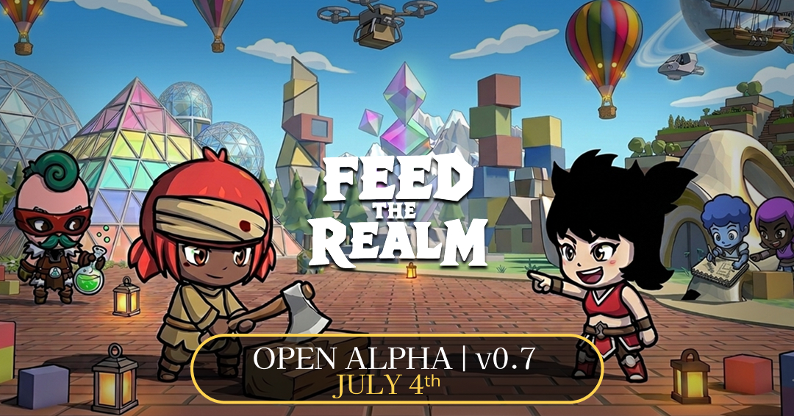

# Join the Feed the Realm Open Alpha Playtest!

Hello everyone, welcome aboard!

## What is Feed the Realm?

**Feed the Realm** is a community-driven massively multiplayer online (MMO) game where every adventure takes place in worlds created by players.

Explore an ever-growing collection of unique worlds, battle enemies, complete quests, collect powerful equipment, and meet players from around the globe.

Your **character identity and cosmetic collection** travel with you across every world you visit, letting you express yourself 
consistently wherever your adventures take you. Meanwhile, **inventory, equipment, quests, and progression are unique to each world**,
carrying over seamlessly between that world's connected zones while preserving each creator's intended experience.

If you're feeling creative, our powerful **World Editor** lets anyone build their own experiences no matter their previous experience.
Design interconnected zones, create quests and NPCs, customize enemies, place loot and shops, upload your own 3D assets,
and publish your world for the entire community to explore.

Whether you enjoy playing, creating, or both, Feed the Realm is built around the idea that the community shapes the game.

## Open Alpha Features

During the Alpha you'll be able to experience many of the game's core systems, including:

* Explore community-created worlds from the global world feed.
* Fight enemies using melee and ranged weapons.
* Complete quest chains with multiple objective types.
* Collect loot, equipment, consumables, and gold.
* Interact with NPCs and other players in real-time multiplayer.
* Customize your character and purchase cosmetics shared across every world.
* Create and publish your own worlds using the World Editor **(limited seats)**.

## Join the Playtesting Session

The Open Alpha is available for anyone who wants to play the game or experiment with the World Editor at their own pace.

We're also hosting a live playtesting session with the developers, where you'll have the opportunity to:

* Play alongside the development team.
* Share your feedback directly with us.
* Meet other players and creators.
* Help us identify bugs and improve the game.
* Be featured in gameplay highlight videos that may become part of future promotional material, including the game's trailer.

If you're looking for a fun Sunday activity or simply want to help shape the future of Feed the Realm, we'd love to have you with us!

**📅 Saturday July 4th - 18:00 (UTC-3)**

Join us on Discord via [this link](https://discord.com/invite/sQ9uwjQKwX)

Thank you for helping us build Feed the Realm. We can't wait to see the worlds you'll explore and the ones you'll create!

