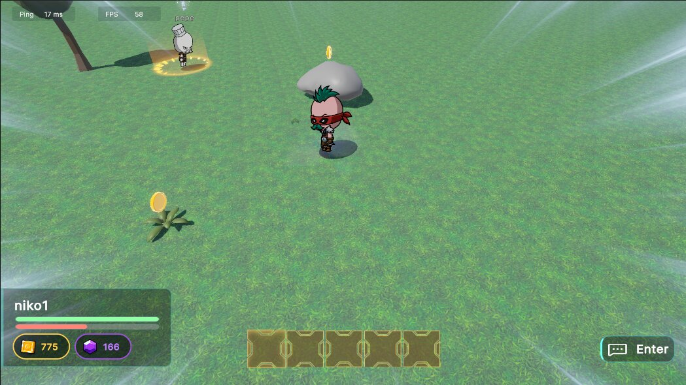
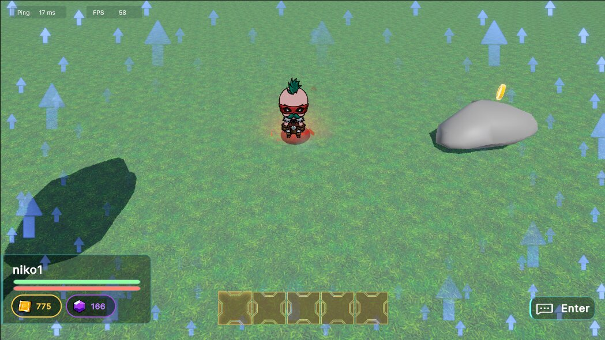
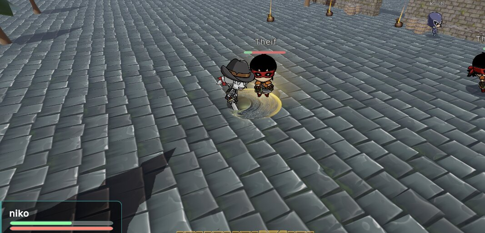

# Feed the Realm VFX update!
Hello world surfers!

## What's new?
We are happy to announce that we improved some visual effects on some existing features.

## Highlights

- ✨ **New particle effects** when interacting with key elements of the world.
- 💥 **Improved visual feedback** on player actions, making every interaction feel more alive.
- ❗ **New VFX markers** to help players to understand better all features in-game.

We've been listening to your feedback, and one thing was clear: the game needed more visual "juice" to make actions feel satisfying. This update is the first step towards that goal, and we're already working on more VFX for upcoming features.

## What's next?

We're planning to keep iterating on visual polish in future updates, including:

- More environmental effects
- Improved UI feedback
- Performance optimizations so all these effects run smoothly and don't affect the performance.

## Thank you!

As always, thanks for being part of all of this with us. Your feedback keeps shaping Feed the Realm into something better with every update. Stay tuned for more news soon!

See you in the next wave, world surfers! 🌐🏄